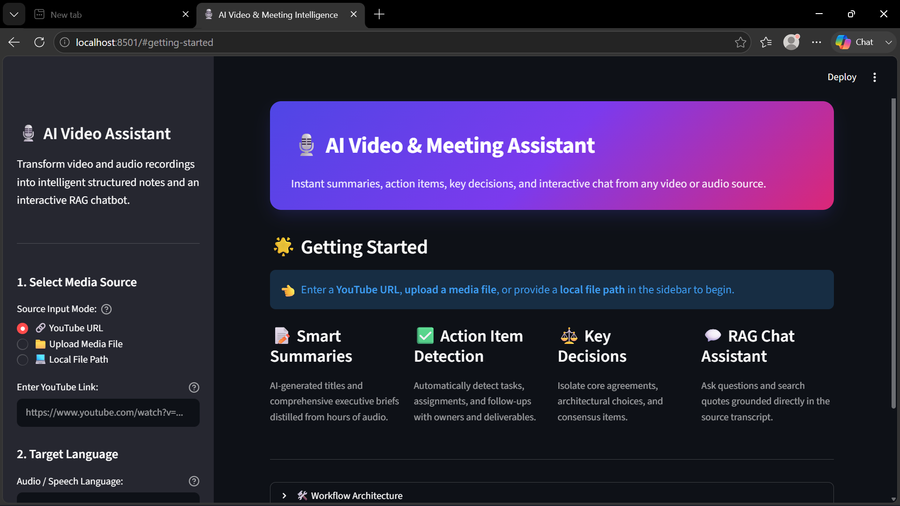

# 🎙️ AI Video & Meeting Intelligence

An end-to-end pipeline that turns raw video/audio (YouTube links or local files) into structured, searchable meeting intelligence — transcripts, executive summaries, action items, key decisions, open questions, and a RAG-powered chat interface to query the content directly.

Built with **LangChain (LCEL)**, **Google Gemini**, **OpenAI Whisper**, **Sarvam AI**, **ChromaDB**, and **Streamlit**.

🔗 **[Live Demo](https://your-streamlit-url-here.streamlit.app)** *(replace with your actual deployed URL)*

> ⚠️ **Known limitation on the live demo:** YouTube URL processing works reliably when run locally, but may fail on the deployed version — YouTube blocks requests from cloud/datacenter IP ranges (this affects Streamlit Cloud, Hugging Face Spaces, and virtually every free cloud host equally, not just this project). **File upload is the recommended input method on the live demo.** YouTube URL input works perfectly when the app is run locally. See the demo video below for the full pipeline including YouTube URL support.

---

## ✨ Features

- 📝 **Smart Summaries** — AI-generated titles and executive briefs distilled from hours of audio
- ✅ **Action Item Detection** — automatically extracts tasks, owners, and deadlines
- 🔑 **Key Decisions** — isolates core agreements and consensus points from the discussion
- 💬 **RAG Chat Assistant** — ask questions about the content; answers are grounded directly in the transcript, not hallucinated
- 🌐 **Multi-source input** — YouTube URL, uploaded media file, or local file path
- 🗣️ **Dual speech-to-text engine, chosen by language:**
  - **English** → OpenAI Whisper, running fully locally (no API cost, no data leaves your machine)
  - **Hinglish** → Sarvam AI's speech-to-text-translate API, which transcribes and translates Hindi/Hinglish speech to English in one step
- 📥 **Export** — download results as Markdown report, raw transcript, or structured JSON
- 🔍 **In-transcript keyword search**

---

## 🖥️ Demo



---

## 🏗️ Architecture

```
                ┌──────────────────┐
   YouTube URL  │                  │
   or Local File├─► audio_processor├─► Chunked WAV audio (10-min chunks)
                │  (yt-dlp/pydub)  │
                └──────────────────┘
                          │
                          ▼
              ┌────────────────────────┐
              │      transcriber        │
              │  routes by language:    │
              │                         │
              │  english  → Whisper     │   (local model, no API cost)
              │  hinglish → Sarvam AI   │   (cloud STT + translation,
              │             (25s pieces)│    25s pieces per API limit)
              └────────────────────────┘
                          │
                          ▼
                    Full Transcript
                          │
          ┌───────────────┼────────────────┐
          ▼               ▼                ▼
    ┌───────────┐  ┌─────────────┐  ┌──────────────┐
    │summarizer │  │  extractor   │  │  rag_engine   │
    │(title +   │  │(action items,│  │ (ChromaDB +   │
    │ summary)  │  │ decisions,   │  │  Gemini chat)  │
    │           │  │ questions —  │  │               │
    │           │  │ 1 combined   │  │               │
    │           │  │ API call)    │  │               │
    └───────────┘  └─────────────┘  └──────────────┘
          │               │                │
          └───────────────┼────────────────┘
                          ▼
                 Streamlit UI (app.py)
         Tabs: Summary · Actions/Decisions ·
          Open Questions · RAG Chat · Export
```

All Gemini API calls are routed through a custom **rate limiter with exponential backoff** (`core/rate_limiter.py`) to stay within free-tier quota limits and gracefully retry on transient failures.

---

## 🧰 Tech Stack

| Layer | Technology |
|---|---|
| LLM | Google Gemini (`gemini-3.5-flash-lite`) via `langchain-google-genai` |
| Orchestration | LangChain (LCEL — pipe-based chains) |
| Speech-to-Text (English) | OpenAI Whisper — local model, no API cost |
| Speech-to-Text + Translation (Hinglish) | Sarvam AI (`saaras:v2.5`) — cloud API |
| Vector Store / RAG | ChromaDB (`langchain-chroma`) + HuggingFace sentence-transformer embeddings |
| Frontend | Streamlit |
| Audio ingestion | yt-dlp, pydub, ffmpeg, torchvision |

---

## ⚙️ Setup & Installation

### 1. Clone the repository
```bash
git clone https://github.com/Shahnaz-Parveen/AI-Video-Meeting-Assistant.git
cd AI-Video-Meeting-Assistant
```

### 2. Create a virtual environment
```bash
python -m venv .venv
# Windows
.venv\Scripts\activate
# macOS/Linux
source .venv/bin/activate
```

> This project is tested on **Python 3.11**. A `runtime.txt` file pins this version for cloud deployment.

### 3. Install dependencies
```bash
pip install -r requirements.txt
```

### 4. Install FFmpeg (required for audio processing)
- **Windows:** `choco install ffmpeg`
- **macOS:** `brew install ffmpeg`
- **Linux:** `sudo apt-get install ffmpeg`

> For cloud deployment (e.g. Streamlit Cloud), `packages.txt` handles installing `ffmpeg` at the system level automatically — no manual step needed there.

### 5. Set up your API keys
Create a `.env` file in the project root:
```env
GOOGLE_API_KEY=your_gemini_api_key_here
SARVAM_API_KEY=your_sarvam_api_key_here
HF_TOKEN=your_huggingface_token_here
```
- Gemini key (free, no credit card): [Google AI Studio](https://aistudio.google.com/apikey)
- Sarvam key (only needed if you plan to use Hinglish transcription): [Sarvam AI](https://www.sarvam.ai/)
- Hugging Face token (optional, improves embedding model download rate limits): [HF Tokens](https://huggingface.co/settings/tokens)

> **Note:** `SARVAM_API_KEY` is only required if you select "hinglish" as the transcription language. English-only usage works with just the Gemini key.

### 6. Run it

**CLI version:**
```bash
python main.py
```

**Streamlit web app:**
```bash
python -m streamlit run app.py
```

---

## ☁️ Deployment

This project is deployed on **Streamlit Community Cloud**, pulling directly from this GitHub repo. Three deployment-specific files make this work:

| File | Purpose |
|---|---|
| `requirements.txt` | Python package dependencies |
| `packages.txt` | System-level dependencies (`ffmpeg`, needed for audio processing on the cloud host) |
| `runtime.txt` | Pins the Python version (3.11) used by the deployment environment |

If deploying your own fork, remember to set your secrets (`GOOGLE_API_KEY`, `SARVAM_API_KEY`, `HF_TOKEN`, `WHISPER_MODEL`) in Streamlit Cloud's **Advanced Settings → Secrets** panel, and explicitly select **Python 3.11** in the Python version dropdown at deploy time (the `runtime.txt` file alone has been unreliable on Streamlit Cloud as of late 2026).

---

## 📊 Rate Limits & Free Tier

This project runs entirely on Google Gemini's **free tier** (`gemini-3.5-flash-lite`):
- 15 requests/minute
- 500 requests/day

To stay within these limits, the project includes:
- A custom rate limiter that spaces out API calls and retries failures with exponential backoff
- A **combined extraction call** — action items, key decisions, and open questions are extracted in a single API call instead of three, cutting quota usage for that stage by ~66%
- Tunable transcript chunking (`chunk_size` / `chunk_overlap`) to balance summary quality against number of API calls

Whisper transcription (English) runs locally and has no API quota at all. Sarvam transcription (Hinglish) is subject to Sarvam's own separate rate limits — check their docs if you plan on heavy Hinglish usage.

**Because this runs on a free tier, a few consequences are worth knowing if you fork or rely on this:**
- Heavy usage (many videos processed in a short window) can hit the 500/day or 15/minute ceiling, resulting in temporary `429` errors until quota resets (daily reset is midnight Pacific Time)
- Model availability has shifted multiple times during development as Google deprecates older model versions — the model name in `core/summarizer.py`, `core/extractor.py`, and `core/rag_engine.py` may need updating if Google retires `gemini-3.5-flash-lite` in the future
- No paid fallback is configured — if quota is exhausted, the app will show an error rather than silently switching to a paid tier (this is intentional, to avoid unexpected charges)

---

## 📁 Project Structure

```
├── app.py                  # Streamlit web UI
├── main.py                 # CLI entry point
├── core/
│   ├── transcriber.py      # Dual-engine transcription: Whisper (English) / Sarvam (Hinglish)
│   ├── summarizer.py       # Title & executive summary generation
│   ├── extractor.py        # Action items / decisions / questions (combined call)
│   ├── rag_engine.py       # RAG chain — retrieval + grounded Q&A
│   ├── vector_store.py     # ChromaDB embedding + retrieval
│   └── rate_limiter.py     # API call throttling + retry logic
├── utils/
│   └── audio_processor.py  # YouTube/local file ingestion, WAV conversion & chunking
├── requirements.txt         # Python dependencies
├── packages.txt             # System dependencies for cloud deployment (ffmpeg)
├── runtime.txt               # Python version pin (3.11) for cloud deployment
├── demo.png                  # App screenshot
└── .env                       # API keys (not committed — see .gitignore)
```

---

## 🌍 How Hinglish Transcription Works

Sarvam's synchronous speech-to-text-translate API only accepts audio clips up to 30 seconds long. To work around this, `transcriber.py` automatically:
1. Splits each 10-minute audio chunk into 25-second pieces (with a 5-second safety margin)
2. Sends each piece to Sarvam individually
3. Stitches the translated English transcripts back together in order

This is fully automatic — the caller just passes `language="hinglish"` and never has to think about the underlying piece-splitting.

---

## 🚧 Known Limitations

- **YouTube URL input fails on cloud deployment** — YouTube blocks requests from datacenter/cloud IP ranges, affecting Streamlit Cloud, Hugging Face Spaces, and most free cloud hosts equally. Works reliably when run locally. File upload is unaffected either way.
- Free-tier daily quota (500 requests/day on Gemini) means heavy usage or many concurrent users could hit rate limits
- Whisper transcription runs on CPU by default — larger files take longer without a GPU
- Hinglish transcription depends on Sarvam AI's API availability and its own separate rate limits
- RAG retrieval quality depends on transcript chunking granularity

---

## 🔮 Possible Future Improvements

- Speaker diarization (who said what)
- Support for additional languages beyond English/Hinglish
- Persistent storage for multiple past meetings
- Residential proxy integration for reliable YouTube URL support on cloud deployments
- Deployment with billing-capped Gemini tier for public access

---

## 📄 License

MIT — feel free to use, modify, and learn from this project.
